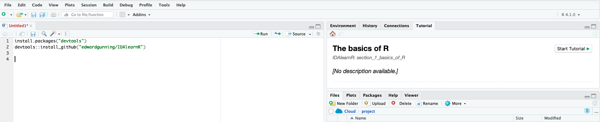

<!-- README.md is generated from README.Rmd. Please edit that file -->

```{r, include = FALSE}
knitr::opts_chunk$set(
  collapse = TRUE,
  comment = "#>",
  fig.path = "man/figures/README-",
  out.width = "100%"
)
```

# IDAlearnR

<!-- badges: start -->
```{r, fig.asp=1, out.width="200px", echo = FALSE}
#knitr::include_graphics(path = "inst/figures/hex-badge.png")
```
<!-- badges: end -->

The goal of IDAlearnR is to publish interactive tutorials for the module **"Introduction to Data Analytics with R"**.

## Installation

You can install IDAlearnR from [GitHub](https://github.com/) with:

``` r
# install.packages("devtools")
devtools::install_github("edwardgunning/IDAlearnR")
```
## Interactive tutorials

### Launching from the Tutorials pane

Once you have installed the package, you should be able to launch the tutorials from the "Tutorial" pane on the right-hand side of the RStudio IDE (provided that you have a recent version of RStudio installed). 



Press "Start Tutorial" and once it has loaded in the pane, press the  button to open the tutorial in an internet browser.

Otherwise, you can launch them using the `run_tutorial()` function from the `learnr` package.

### Launching using `run_tutorial()`

#### Tutorial 1 - The basics of R

``` r
learnr::run_tutorial(name = "section_1_basics_of_R",
                     package = "IDAlearnR")
```

#### Tutorial 2 - Lists, loops and functions

``` r
learnr::run_tutorial(name = "section_2_lists_loops_functions",
                     package = "IDAlearnR")
```
