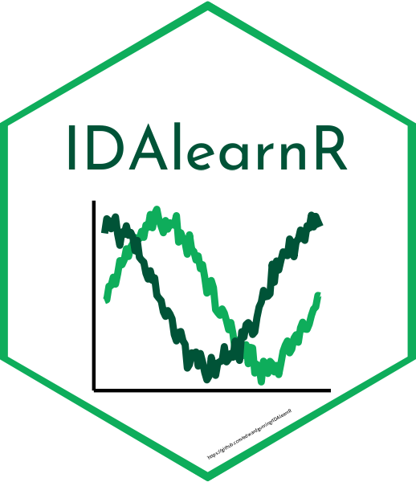

<!-- README.md is generated from README.Rmd. Please edit that file -->

# IDAlearnR

<!-- badges: start -->


<!-- badges: end -->

The goal of IDAlearnR is to publish interactive tutorials for the module
**“Introduction to Data Analytics with R”**.

## Installation

You can install IDAlearnR from [GitHub](https://github.com/) with:

``` r
# install.packages("devtools")
devtools::install_github("edwardgunning/IDAlearnR")
```

## Interactive tutorials

### Tutorial 1 - The basics of R

This tutorial serves as an introduction to programming in R. To launch,
run:

``` r
learnr::run_tutorial(name = "section_1_basics_of_R",
                     package = "IDAlearnR")
```
